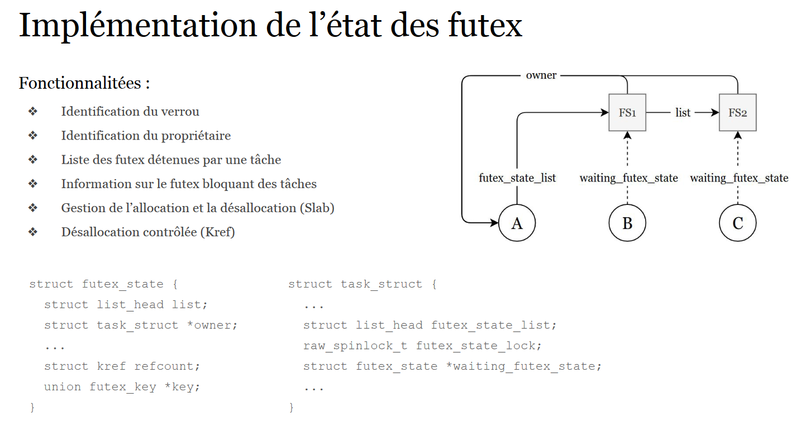
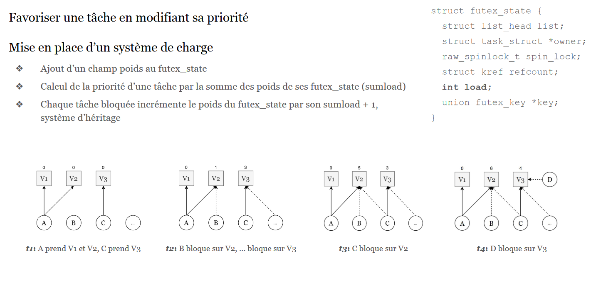
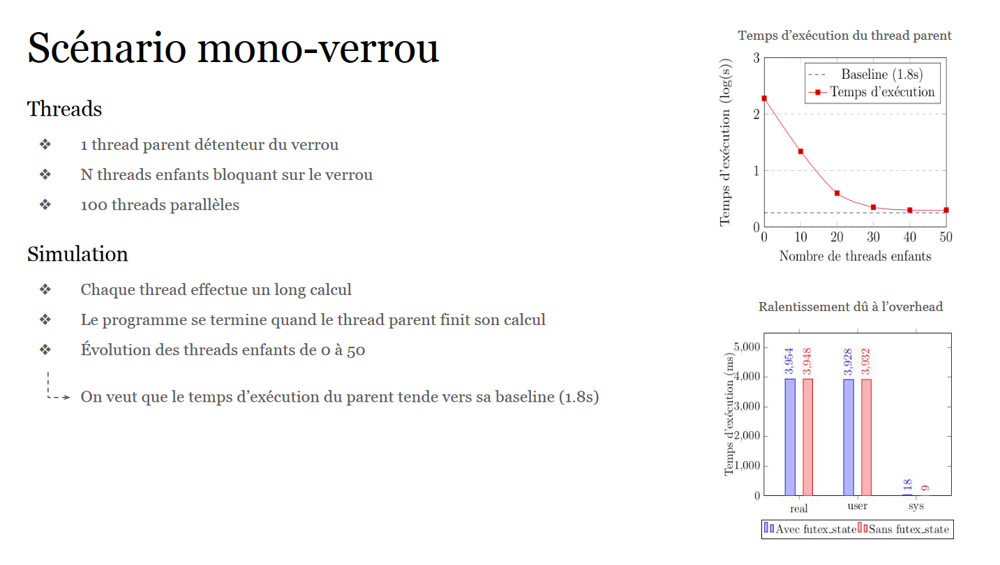
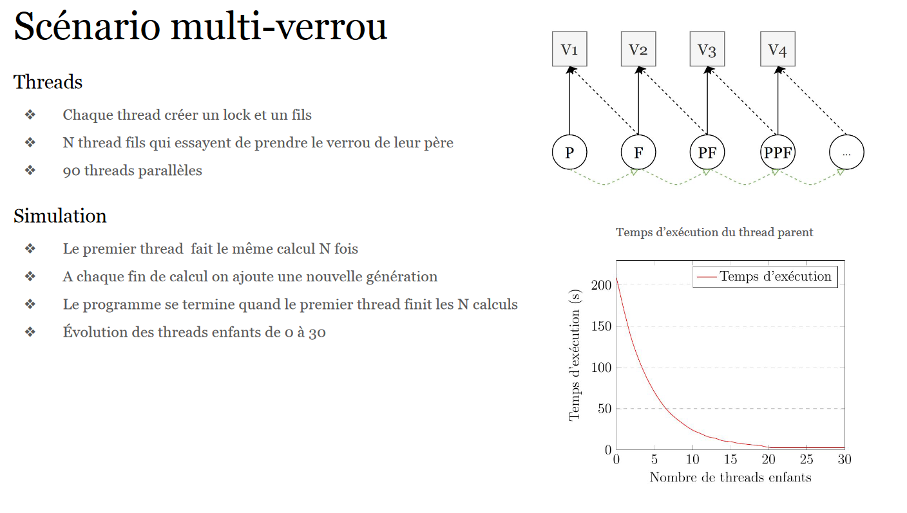

# MAScheduler
Mutex Aware Scheduler
---------------------------------

Un des rôles les plus importants pour un système d'exploitation est
l'exé-cution de plusieurs tâches simultanément, c'est ce qu'on
appelle le multitasking. Le processeur de la machine est une ressource
partagée par l'ensemble des tâches qui s'y exécutent. L'objectif est donc
que chaque tâche puisse y avoir accès pour de s'exécuter 
convenablement. D'un point de vue utilisateur l'alternance de l'exécution
des tâches doit être imperceptible.

C'est l'ordonnanceur, scheduler en anglais, qui s'occupe de cette tâche
critique. Il a pour but premier de rendre le multitasking le plus efficace
possible en utilisant le moins de ressources et en respectant les trois principes
clés qui sont: Safety, Liveness et Fairness.

L'exécution parallèle des tâches sur le processeur implique parfois à celles-ci
de se synchroniser, cela peut se faire grâce aux verrous. Un verrou est une
ressource partagée où son détenteur bloque les autres tâches qui
souhaiteraient le prendre. 

Un problème se présente quand plusieurs processus souhaitent accéder à une même
ressource critique protégée par un verrou. 
En effet, si le processus, qui détient le verrou, empêche un ou plusieurs processus 
d'avancer il est important de le faire passer en priorité dans les 
élections. Ainsi, en favorisant le processus propriétaire du verrou, ce dernier 
pourra arriver plus rapidement au point de libération de la ressource, et ainsi 
débloquer les autres processus en attente.

Les objectifs de notre projet ont donc été les suivants: optimiser les
décisions de l'ordonnanceur pour apporter une élection plus favorable aux
processus détenant un verrou.

# Implémentation

Notre choix d'implémentation a donc été de ne pas modifier directement le code du scheduler (**<kernel/sched/fair.c>**), mais d'ajouter notre mécanisme lors de la prise de
verrou dans le code
du futex **kernel/futex.c** et d'agir directement sur les priorités des tâches.

L'ensemble de nos modifications dans le kernel on été préfixés par un commentaire \verb|MAS code|, pour
**Mutex Aware Scheduler**.

# Structure
Nous avons ajouté une structure **futex_state** qui représente l'état d'un
futex:

	

Les champs sont les suivants:

-**list** permet de créer un chaînage entre les futex d'un même propriétaire.

-**item ** est une référence sur la **task_struct** du propriétaire du futex.

-**spin_lock** permet d'éviter les accès concurrents lors de la manipulation de	la structure.

-**kref** est un compteur de référence pour protéger la suppression des structures, et ainsi éviter de libérer la structure utilisée ailleurs.

-**load** est le poids associé au futex.

-**key** est la clé du futex, permettant d'identifier la structure pour un futex donné.

Une modification sur la structure **task_struct** a été nécessaire:

Les champs ajoutés sont les suivants:

-**futex_state_list** est l'ensemble des

-**futex_state** que la tâche détient et sur lesquels d'autres tâches attendent.

-**futex_state_lock** est un verrou pour la manipulation de la liste.

-**waiting_futex_state** est un pointeur vers le **futex_state** sur lequel la tâche attend.

-**user_nice** est le valeur courante du nice utilisateur appliquée à la tâche.

-**futex_state_prio** est l'augmentation de priorité appliquée à la tâche en fonction
	des autres tâches qu'elles bloquent.
	
	

# Gestion des priorités

	

# Gain de performances
Dans un premier temps nous avons mesuré le temps nécessaire au thread parent pour exécuter son calcul
sans thread parallèle, qui serait concurrent, et sans enfant.
Ce temps d'exécution est noté baseline est correspond à 1,8s.

	

	

# Usage
## Get the v4.19.3 of linux kernel
### From mirror
$ wget https://git.kernel.org/pub/scm/linux/kernel/git/stable/linux.git/tag/?h=v4.19.3

### Or clone the stable version and downgrade
$ git clone git://git.kernel.org/pub/scm/linux/kernel/git/stable/linux-stable.git
$ cd linux-stable
$ git checkout -b my4.19.3 v4.19.3

## Apply the patch
$ patch -p1 < MAS.patch

## Compile the kernel
$ make -j `nproc`

## We also provide two modules 
- debug: Print debug's messages : $ insmod debug.ko
- disable: Disable the MAS mecanism : $ insmod disable.ko

## Programs to test and benchmark are also provided
